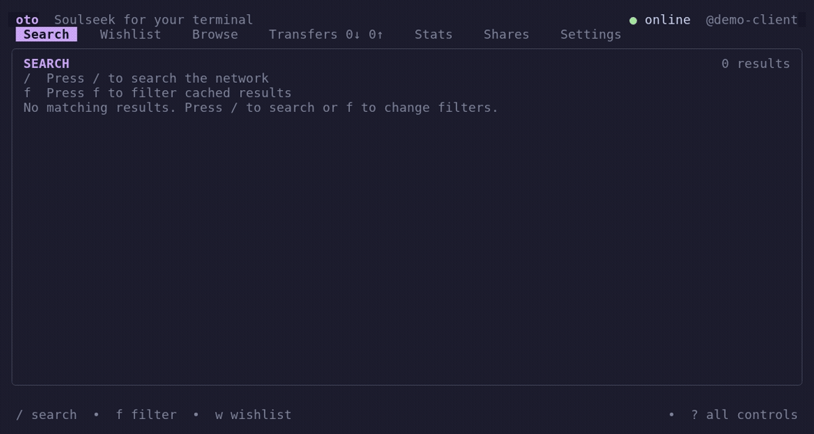

<p align="center">
  
</p>

<p align="center">
  <a href="https://github.com/catgirl-systems/oto/releases/latest"></a>
  <a href="https://github.com/catgirl-systems/oto/actions/workflows/release.yml"></a>
  <a href="https://github.com/catgirl-systems/oto/releases/tag/v0.2.2"></a>
  <a href="https://github.com/catgirl-systems/oto/pkgs/container/oto"></a>
  <a href="LICENSE"></a>
</p>

**Soulseek in your terminal.** Search, share and transfer files on Linux. No slskd required.



Search with `/`, browse a result with `b`, select a file with `Space`, and download with `d`. In Transfers, `p` pauses and `r` resumes.

[Without Docker](#without-docker) · [With Docker](#with-docker) · [Basics](#basics) · [Nicotine+ comparison](#nicotine-comparison)

## Without Docker

Download the [latest binary](https://github.com/catgirl-systems/oto/releases/latest) for your architecture, rename it to `oto`, then:

```sh
chmod +x oto
./oto
```

First launch asks for your Soulseek credentials, download directory and shares. Install **ffmpeg** if you want audio metadata; it is optional.

To build instead, with Go 1.25+:

```sh
git clone https://github.com/catgirl-systems/oto.git
cd oto
go build -o oto ./cmd/oto
./oto
```

For an always-on session, run `./oto daemon` under systemd or in tmux after setup. Start `./oto` in another terminal to attach; quitting an attached UI leaves that daemon running. Otherwise, the UI starts its own daemon and stops it on exit.

## With Docker

Save as `compose.yaml`. Change the credentials, set `PUID`/`PGID` to your `id -u`/`id -g`, and point `./music` at the folder you want to share.

```yaml
services:
  oto:
    image: ghcr.io/catgirl-systems/oto:latest
    environment:
      PUID: "1000"
      PGID: "1000"
      OTO_USERNAME: your-soulseek-username
      OTO_PASSWORD: your-soulseek-password
    volumes:
      - ./oto-config:/config
      - ./downloads:/downloads
      - ./music:/shares/music:ro
    ports:
      - "50300:50300/tcp"
    restart: unless-stopped
    logging:
      driver: json-file
      options:
        max-size: "10m"
        max-file: "3"
        compress: "true"
```

```sh
chmod 600 compose.yaml
mkdir -p oto-config downloads music
docker compose up -d
docker compose exec --user abc oto oto --config /config/config.json
```

The last command opens the TUI; quitting it leaves transfers running. The image includes ffmpeg and supports amd64/arm64. Pin `:0.2.2` instead of `:latest` to avoid automatic version changes when pulling.

Configuration is created at `./oto-config/config.json`; state also lives under `./oto-config`. The default share is `/shares/music`. Edit settings in the TUI, or stop the container before editing the file and start it again afterward. Environment values override the file. Treat the Compose file as a secret; don't commit it.

## Basics

| Key | Action |
| --- | --- |
| `Tab` / `Shift+Tab` | Switch workspaces |
| `/` | Search or add an item |
| `f` | Filter results / find in a browse list |
| `Space` | Select files |
| `d` | Download; cancel in Transfers |
| `p` / `r` in Downloads | Pause / resume |
| `s` in Settings | Save changes |
| `?` | Full keyboard guide |
| `q` | Quit |

Headless controls, with a daemon running:

```sh
./oto status
./oto transfers
./oto pause DOWNLOAD_ID
./oto resume DOWNLOAD_ID
./oto rescan
```

- **Configuration:** `~/.config/oto/config.json`; **state:** `~/.local/state/oto/` (XDG overrides supported). See [config.example.json](config.example.json) for settings; its paths are Docker defaults.
- **Large shares:** Settings → Browse controls maximum files/folders (default 2,000,000), compressed response size (64 MiB), and decompressed response size (256 MiB). Saved changes apply to the next browse without reconnecting. These are payload limits, not total RAM limits: decoded snapshots use additional memory. JSON keys live under `browse` in the example config; accepted ranges are 1–10,000,000 entries, 1–256 MiB compressed, and 1–1024 MiB decompressed.
- **Browse memory:** the daemon streams decompression and retains directory-grouped snapshots. The TUI loads folders on expansion, with at most 200 entries per page; Previous/Next replaces that folder's page instead of accumulating its files. Local browse replies have a 2 MiB cap. Navigation and `f` search use the existing snapshot, not another peer request. Selection includes unloaded descendants, and `s` saves the full snapshot (temporarily expanding paths for the cache writer).
- **Connectivity:** allow incoming TCP **50300** for best results. NAT-PMP/UPnP forwarding is attempted automatically. VPN users can select a network interface in Settings.
- **Accounts:** Soulseek allows one session per username—don't run oto and another client on the same account simultaneously.
- **Privacy:** Soulseek traffic is not encrypted. Only share files you intend to make public.
- **Backups:** stop oto before copying its state directory, including SQLite sidecars. Unsupported database schemas are rejected, not migrated.

## Diagnostic logs

In **Settings → Logging → Level**, choose `DEBUG`, `INFO` (default), `WARN`, or `ERROR`, then save. The persisted `logging.level` setting is case-insensitive and normalized to uppercase; missing/empty values mean `INFO`. A successful save changes the running logger immediately, without reconnecting or rescanning. A failed save leaves the old level active. There is no logging environment variable or command-line override.

The daemon writes JSON Lines with UTC `time`, `level`, stable event names in `msg`, a process `run_id`, and structured component/operation/connection identifiers. `INFO` records lifecycle events; `DEBUG` adds protocol stages and five-second transfer summaries, including stalled streams. `WARN` includes recoverable failures and a single stall transition after 30 seconds without progress; `ERROR` includes terminal and persistence failures. Handshake writes and port advertisements do **not** prove peer acceptance or external reachability; a remote upload-failure message does not establish its underlying cause.

Transfer summaries separate received/written bytes from `committed_bytes`, the offset reported through application progress callbacks (not an fsync or SQLite-checkpoint guarantee). Missing last-data/progress ages mean no observation yet, rather than zero elapsed time.

Managed files live in `${XDG_STATE_HOME:-$HOME/.local/state}/oto/logs` (normally `~/.local/state/oto/logs`). The Docker image defaults to `/config/oto/logs`; setting `XDG_STATE_HOME=/data/state` instead gives `/data/state/oto/logs`. **Stats → Diagnostic logs** shows the daemon's actual directory, effective level, stored bytes/file count, dropped records since startup, retention policy, and output/recovery warnings. These figures are daemon-wide even with a peer/account filter. Storage is actual compressed/on-disk size, including recovery/temporary files; metadata is cached for up to five seconds.

```sh
log_dir="${XDG_STATE_HOME:-$HOME/.local/state}/oto/logs"
tail -F "$log_dir/daemon.log"
gzip -cd "$log_dir"/daemon-*.log.gz
```

The active `daemon.log` stays uncompressed. Before a complete record would exceed **10 MiB**, oto rotates it and streams gzip compression, retaining **three closed segments** (for example `daemon-000001.log.gz`). Uncompressed recovery segments count toward those three slots. Directories use `0700`, files `0600`; symlink/non-regular managed files are rejected. Interrupted compression is recovered where possible, preserving the source on failure. Unsafe/incomplete recovery or pruning failures suspend file output rather than allowing unlimited growth. This is a size/count policy, **not an exact 40 MiB disk quota**: gzip overhead and one temporary compression copy add bounded overhead. Compression and retention are fixed, independently of transfer-history retention.

Foreground/Docker daemons also mirror records to stderr. Docker's separate copy is **not** counted or managed by oto; the Compose example above bounds it separately. TUI-launched daemons write managed files without normal stderr mirroring; startup failure capture is limited to 32 KiB. An old `oto/daemon.log` directly in the state directory is left untouched: oto stops appending to it, and neither retention nor Stats includes it. Review/remove that legacy file yourself if no longer needed.

Diagnostics are **best effort, not an audit journal**. One worker drains a 256-record nonblocking queue; full queues drop new records and report loss in Stats and a recovery summary. Records are capped at 8 KiB; oversized records become small omission events. Disk/compression/stderr delays do not block transfer producers. File failures leave the stderr sink available where possible, with file retries no more often than every 30 seconds. Shutdown allows two seconds to drain; crashes, SIGKILL, or indefinitely blocked output can lose records.

**Treat logs as sensitive before sharing:** peer usernames and IP:port endpoints are included. Passwords, authentication/wire tokens, payloads, chat/search contents, filenames, share/download paths, hook commands, and whole configuration/transfer objects are excluded. Unknown error/rejection text is omitted; safe stage/class/syscall fields are logged instead. Existing user-facing transfer history is separate and unchanged.

### Logging measurements

Reproduce with `go test ./internal/diagnostics -run '^$' -bench '^BenchmarkLogging$' -benchmem -benchtime=200ms -count=3`. Local medians on Go 1.26.7, Linux/amd64, Ryzen 9 7950X:

| DEBUG call | ns/call | B/call | allocations/call | attempted calls/s |
| --- | ---: | ---: | ---: | ---: |
| Filtered by INFO | 11.53 | 0 | 0 | 86.7 million |
| Enabled | 874.5 | 189 | 2 | 1.14 million |

This measures producer-path time with managed files and discarded stderr; allocation figures include concurrent output-worker activity. It is **not lossless storage throughput**: the enabled median-latency run dropped 55,719 of 275,401 attempts under queue pressure. It is not a comparison with other logging libraries.

[AGPL-3.0-only](LICENSE). Offline country data: [ip-location-db](https://github.com/sapics/ip-location-db), PDDL.

## Nicotine+ comparison

oto focuses on file sharing and a detachable terminal UI. [Nicotine+](https://nicotine-plus.org/) also has a desktop GUI, chat, buddies, user profiles and plugins.

<details>
<summary>Full feature comparison</summary>

:white_check_mark: supported · :x: unavailable · :fast_forward: different approach

### Network and session

| Feature | oto | Nicotine+ |
| --- | --- | --- |
| Soulseek account login | :white_check_mark: | :white_check_mark: |
| Create a new account by logging in with unused credentials | :white_check_mark: | :white_check_mark: |
| Custom Soulseek server | :white_check_mark: | :white_check_mark: |
| Configurable listening address and port | :white_check_mark: | :white_check_mark: |
| Incoming direct peer connections | :white_check_mark: | :white_check_mark: |
| Direct outbound peer connections | :white_check_mark: | :white_check_mark: |
| Server-mediated firewall piercing | :white_check_mark: | :white_check_mark: |
| Distributed-search network participation | :white_check_mark: | :white_check_mark: |
| Respond to incoming searches | :white_check_mark: | :white_check_mark: |
| Automatic reconnect after connection failure | :white_check_mark: | :white_check_mark: |
| Manually connect and disconnect without quitting | :white_check_mark: | :white_check_mark: |
| Configure whether to connect on startup | :white_check_mark: | :white_check_mark: |
| Bind Soulseek traffic to a VPN or network interface | :white_check_mark: | :white_check_mark: |
| Automatic UPnP port forwarding | :white_check_mark: | :white_check_mark: |
| Automatic NAT-PMP port forwarding | :white_check_mark: | :white_check_mark: |
| External listening-port check | :white_check_mark: | :white_check_mark: |
| Public IP address lookup | :white_check_mark: | :white_check_mark: |
| Change Soulseek password from the client | :white_check_mark: | :white_check_mark: |
| Online, away, and offline status controls | :white_check_mark: | :white_check_mark: |
| Automatic away status after inactivity | :x: | :white_check_mark: |
| Automatic private-message reply while away | :x: | :white_check_mark: |
| Check remaining Soulseek supporter privileges | :x: | :white_check_mark: |
| Gift Soulseek privileges to another user | :x: | :white_check_mark: |

### Search

| Feature | oto | Nicotine+ |
| --- | --- | --- |
| Global file search | :white_check_mark: | :white_check_mark: |
| Exact quoted phrases | :white_check_mark: | :white_check_mark: |
| Excluded search terms | :white_check_mark: | :white_check_mark: |
| Partial-word search terms | :white_check_mark: | :white_check_mark: |
| Search files in joined rooms | :x: | :white_check_mark: |
| Search files shared by all buddies | :x: | :white_check_mark: |
| Search files shared by specific users | :white_check_mark: | :white_check_mark: |
| Cache results and refilter without another network search | :white_check_mark: | :white_check_mark: |
| Include-text result filter | :white_check_mark: | :white_check_mark: |
| Exclude-text result filter | :white_check_mark: | :white_check_mark: |
| Regular-expression result filters | :white_check_mark: | :x: |
| File-extension result filter | :white_check_mark: | :white_check_mark: |
| Generic audio, video, image, document, archive, and executable filters | :white_check_mark: | :white_check_mark: |
| File-size comparisons and ranges | :white_check_mark: | :white_check_mark: |
| Bitrate comparisons and ranges | :white_check_mark: | :white_check_mark: |
| Duration comparisons and ranges | :white_check_mark: | :white_check_mark: |
| Available-upload-slot filter | :white_check_mark: | :white_check_mark: |
| Public/private-file filter | :white_check_mark: | :white_check_mark: |
| Display locked private search results | :white_check_mark: | :white_check_mark: |
| Country-code result filter | :white_check_mark: | :white_check_mark: |
| Persistent search history | :white_check_mark: | :white_check_mark: |
| Persistent filter history | :white_check_mark: | :white_check_mark: |
| Configurable default result filters | :white_check_mark: | :white_check_mark: |
| Persistent wishlist searches | :white_check_mark: | :white_check_mark: |
| Periodically rerun wishlist searches | :white_check_mark: | :white_check_mark: |
| Store filters per wishlist item | :white_check_mark: | :white_check_mark: |
| Manually rerun a wishlist item | :white_check_mark: | :white_check_mark: |
| Notify when a wishlist finds results | :white_check_mark: | :white_check_mark: |
| Disable responses to incoming searches | :white_check_mark: | :white_check_mark: |
| Configure minimum incoming search length | :white_check_mark: | :white_check_mark: |
| Configure maximum results returned to peers | :white_check_mark: | :white_check_mark: |
| Honor server-provided excluded search phrases | :white_check_mark: | :white_check_mark: |

### Browsing users and files

| Feature | oto | Nicotine+ |
| --- | --- | --- |
| Browse another user's shares | :white_check_mark: | :white_check_mark: |
| Browse your own shares | :white_check_mark: | :white_check_mark: |
| Refresh a user's share list | :white_check_mark: | :white_check_mark: |
| Jump from a search result to its user's folder | :white_check_mark: | :white_check_mark: |
| Browse public and private entries returned by a peer | :white_check_mark: | :white_check_mark: |
| Search within a loaded share list | :white_check_mark: | :white_check_mark: |
| Download selected files | :white_check_mark: | :white_check_mark: |
| Download a loaded folder subtree | :white_check_mark: | :white_check_mark: |
| Request and download a complete remote folder recursively | :white_check_mark: | :white_check_mark: |
| Choose a different download destination interactively | :white_check_mark: | :white_check_mark: |
| Save a remote share list to disk | :white_check_mark: | :white_check_mark: |
| Reopen a saved share list, including while offline | :white_check_mark: | :white_check_mark: |
| Show progress while retrieving large share lists | :white_check_mark: | :white_check_mark: |
| View detailed file properties and media metadata | :white_check_mark: | :white_check_mark: |

### Downloads

| Feature | oto | Nicotine+ |
| --- | --- | --- |
| Queue individual file downloads | :white_check_mark: | :white_check_mark: |
| Queue multiple selected downloads | :white_check_mark: | :white_check_mark: |
| Resume partial downloads by byte offset | :white_check_mark: | :white_check_mark: |
| Persist downloads across restarts | :white_check_mark: | :white_check_mark: |
| Retry failed downloads | :white_check_mark: | :white_check_mark: |
| Cancel downloads | :white_check_mark: | :white_check_mark: |
| Clear inactive downloads | :white_check_mark: | :white_check_mark: |
| Explicit pause and resume controls | :white_check_mark: | :white_check_mark: |
| Automatically retry transient download failures | :white_check_mark: | :white_check_mark: |
| Configurable maximum concurrent downloads | :white_check_mark: | :x: |
| Keep incomplete files separate from completed downloads | :white_check_mark: | :white_check_mark: |
| Store downloads in per-user subfolders | :white_check_mark: | :white_check_mark: |
| Avoid overwriting collisions by choosing an unused filename | :white_check_mark: | :white_check_mark: |
| Separate folder for files manually sent by other users | :x: | :white_check_mark: |
| Rename a file before downloading | :x: | :white_check_mark: |
| Automatic filename-based download filters | :white_check_mark: | :white_check_mark: |
| Force a filtered download to bypass filters | :white_check_mark: | :white_check_mark: |
| Global download speed limit | :white_check_mark: | :white_check_mark: |
| Alternate download speed-limit preset | :fast_forward: | :white_check_mark: |
| Run a command after a file finishes | :white_check_mark: | :white_check_mark: |
| Run a command after a folder finishes | :white_check_mark: | :white_check_mark: |
| Notify when a file or folder finishes | :white_check_mark: | :white_check_mark: |
| Automatically clear finished downloads | :white_check_mark: | :white_check_mark: |
| Automatically clear filtered downloads | :x: | :white_check_mark: |
| Allow selected users to send unsolicited files | :x: | :white_check_mark: |
| Request and track remote queue position | :white_check_mark: | :white_check_mark: |
| Show transfer speed and progress | :white_check_mark: | :white_check_mark: |
| Estimate elapsed and remaining transfer time | :white_check_mark: | :white_check_mark: |
| Search the network for a transfer's file or folder name | :white_check_mark: | :white_check_mark: |
| Remove the associated incomplete file when deleting a transfer | :white_check_mark: | :white_check_mark: |

### Uploads

| Feature | oto | Nicotine+ |
| --- | --- | --- |
| Serve shared files to peers | :white_check_mark: | :white_check_mark: |
| Queue competing upload requests | :white_check_mark: | :white_check_mark: |
| Configurable fixed upload-slot count | :white_check_mark: | :white_check_mark: |
| Report upload queue positions | :white_check_mark: | :white_check_mark: |
| Persist completed upload history across restarts | :white_check_mark: | :white_check_mark: |
| Automatically recover unfinished uploads after restart | :white_check_mark: | :x: |
| Retry failed uploads | :white_check_mark: | :white_check_mark: |
| Abort selected uploads | :white_check_mark: | :white_check_mark: |
| Abort every upload from selected users | :white_check_mark: | :white_check_mark: |
| Clear uploads by status | :white_check_mark: | :white_check_mark: |
| Automatically clear finished uploads | :white_check_mark: | :white_check_mark: |
| Automatically clear cancelled uploads | :x: | :white_check_mark: |
| Manually send a file to another user | :x: | :white_check_mark: |
| Manually send a folder to another user | :x: | :white_check_mark: |
| Global upload speed limit | :white_check_mark: | :white_check_mark: |
| Named combined upload/download bandwidth profiles | :white_check_mark: | :x: |
| Alternate upload speed-limit preset | :fast_forward: | :white_check_mark: |
| Limit upload speed per transfer or across all transfers | :white_check_mark: | :white_check_mark: |
| FIFO upload scheduling | :white_check_mark: | :white_check_mark: |
| Round-robin upload scheduling | :white_check_mark: | :white_check_mark: |
| Random upload scheduling | :white_check_mark: | :x: |
| Smallest-file-first upload scheduling | :white_check_mark: | :x: |
| Allocate upload slots until a bandwidth threshold is reached | :x: | :white_check_mark: |
| Prioritize buddies in the upload queue | :x: | :white_check_mark: |
| Prioritize Soulseek privileged users | :x: | :white_check_mark: |
| Per-user queued-file limit (oto includes active files) | :white_check_mark: | :white_check_mark: |
| Per-user queued-byte limit (oto includes active files) | :white_check_mark: | :white_check_mark: |
| Exempt buddies from upload queue limits | :x: | :white_check_mark: |
| Wait for active uploads to finish before quitting | :x: | :white_check_mark: |
| Message all users currently downloading | :x: | :white_check_mark: |

### Shares and permissions

| Feature | oto | Nicotine+ |
| --- | --- | --- |
| Multiple public share roots | :white_check_mark: | :white_check_mark: |
| Custom virtual names for share roots | :white_check_mark: | :white_check_mark: |
| Add and remove shares without restarting | :white_check_mark: | :white_check_mark: |
| Manual share rescan | :white_check_mark: | :white_check_mark: |
| Scan shares on startup | :white_check_mark: | :white_check_mark: |
| Exclude hidden files and folders | :white_check_mark: | :white_check_mark: |
| Configurable share exclusion patterns | :white_check_mark: | :white_check_mark: |
| Persistent on-disk share index | :white_check_mark: | :white_check_mark: |
| Scheduled daily share rescans | :fast_forward: | :white_check_mark: |
| Force a full share rebuild | :x: | :white_check_mark: |
| Stop an in-progress share scan | :white_check_mark: | :white_check_mark: |
| Report share-scan progress | :white_check_mark: | :white_check_mark: |
| Extract audio metadata while indexing local shares | :white_check_mark: | :white_check_mark: |
| Publish shared folder and file counts | :white_check_mark: | :white_check_mark: |
| Public shares | :white_check_mark: | :white_check_mark: |
| Buddy-only shares | :x: | :white_check_mark: |
| Trusted-buddy-only shares | :x: | :white_check_mark: |
| Reveal restricted share tiers selectively | :x: | :white_check_mark: |
| Use buddy trust as a share permission | :x: | :white_check_mark: |

:fast_forward: oto watches share filesystem changes and reconciles after its quiet/max delays instead of waiting for a daily schedule.

### Users, chat, and community

| Feature | oto | Nicotine+ |
| --- | --- | --- |
| Private messages | :x: | :white_check_mark: |
| Queued and offline private messages | :x: | :white_check_mark: |
| Persistent private-message history | :x: | :white_check_mark: |
| Broadcast a private message to buddies or downloading users | :x: | :white_check_mark: |
| Join public chat rooms | :x: | :white_check_mark: |
| Browse the room directory | :x: | :white_check_mark: |
| Public feed of room messages | :x: | :white_check_mark: |
| Create chat rooms | :x: | :white_check_mark: |
| Remember and rejoin rooms | :x: | :white_check_mark: |
| Create and join private rooms | :x: | :white_check_mark: |
| Private-room invitations | :x: | :white_check_mark: |
| Private-room member, operator, and owner management | :x: | :white_check_mark: |
| Persistent room-wall messages | :x: | :white_check_mark: |
| Buddy list | :x: | :white_check_mark: |
| Buddy notes | :x: | :white_check_mark: |
| Buddy online-status notifications | :x: | :white_check_mark: |
| Buddy last-seen timestamps | :x: | :white_check_mark: |
| Prioritized buddies | :x: | :white_check_mark: |
| Trusted buddies | :x: | :white_check_mark: |
| Personal likes and dislikes | :x: | :white_check_mark: |
| Interest-based recommendations | :x: | :white_check_mark: |
| Similar-user discovery | :x: | :white_check_mark: |
| View user profiles | :x: | :white_check_mark: |
| Publish a self-description | :x: | :white_check_mark: |
| View user country, interests, shares, speed, slots, and queue statistics | :x: | :white_check_mark: |
| Resolve and display a user's IP address | :x: | :white_check_mark: |
| Ignore users by username | :x: | :white_check_mark: |
| Ignore users by IP address | :x: | :white_check_mark: |
| Ban users by username | :x: | :white_check_mark: |
| Ban users by IP address | :x: | :white_check_mark: |
| Ban users by country | :x: | :white_check_mark: |
| Custom ban and country-block messages | :x: | :white_check_mark: |
| CTCP/client-information requests | :x: | :white_check_mark: |
| Keyword and mention detection | :x: | :white_check_mark: |
| Chat tab completion | :x: | :white_check_mark: |
| Chat spelling checks | :x: | :white_check_mark: |
| Outgoing text substitutions | :x: | :white_check_mark: |
| Incoming text censorship patterns | :x: | :white_check_mark: |
| `/me` actions and extensible chat commands | :x: | :white_check_mark: |

### Extensibility, persistence, and operation

| Feature | oto | Nicotine+ |
| --- | --- | --- |
| Run the Soulseek client headlessly | :white_check_mark: | :white_check_mark: |
| Interactive command console in headless mode | :x: | :white_check_mark: |
| Scriptable transfer and rescan commands through a daemon socket | :white_check_mark: | :x: |
| Run the network session as a standalone background service | :white_check_mark: | :x: |
| Detach and later attach a frontend to the same live session | :white_check_mark: | :x: |
| Keep transfers running after the attached frontend exits | :white_check_mark: | :x: |
| Plugin system | :x: | :white_check_mark: |
| Install, enable, disable, reload, and configure plugins | :x: | :white_check_mark: |
| Plugin hooks for chat, search, users, and transfers | :x: | :white_check_mark: |
| Extensible chat and headless commands | :x: | :white_check_mark: |
| Built-in spam, anti-shout, leech-detection, and automation plugins | :x: | :white_check_mark: |
| Persistent chat-room logs | :x: | :white_check_mark: |
| Persistent private-chat logs | :x: | :white_check_mark: |
| Persistent transfer logs | :white_check_mark: | :white_check_mark: |
| Configurable diagnostic/debug logs | :white_check_mark: | :white_check_mark: |
| Current-session and lifetime transfer statistics | :white_check_mark: | :white_check_mark: |
| Now-playing messages from MPRIS, Last.fm, Libre.fm, or ListenBrainz | :x: | :white_check_mark: |

</details>
